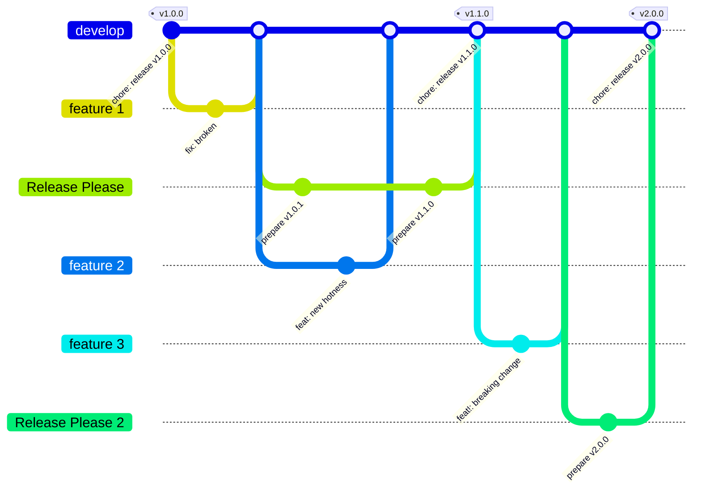
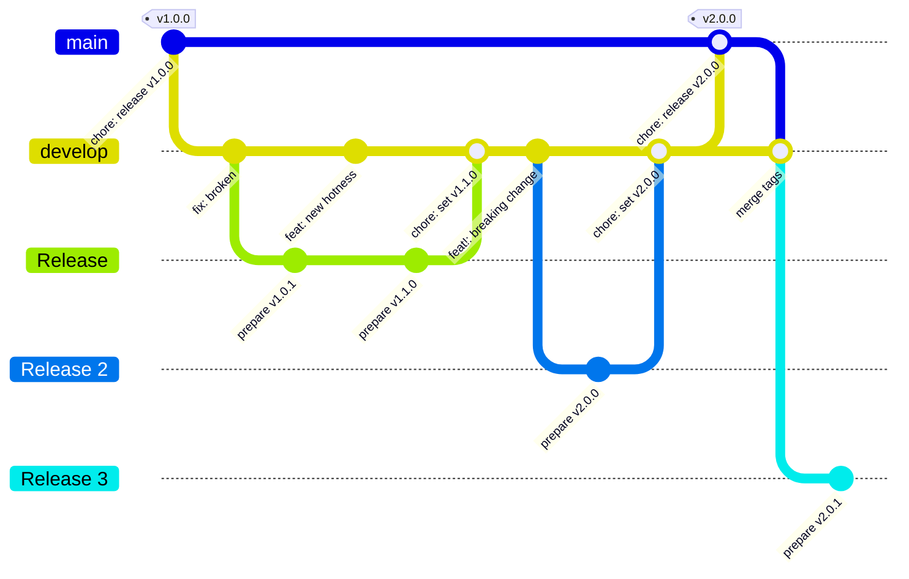

# Release Process

## Proposal 1

* Automated releases as far as UAT
* Automated versioning based on [Conventional Commits](https://www.conventionalcommits.org/en/v1.0.0/)
* Production release version will come from latest tag (manual process)
* No `main` branch (I used `develop` here but it can be anything)
* Avoids merge hell going between `main` and `develop`
* `release` branch automatically kept up-to-date
* Release is tagged when release PR is merged
* UAT build is always latest tag
* Can use git tags to indicate which release is in production
* Must ensure linear commit history!

Using [Release Please](https://github.com/googleapis/release-please/tree/main) as it supports [expo](https://expo.dev) out of the box, I have set up a small demo repo that follows the pattern.

The method here is:

1. Create a feature branch and complete work on it
2. Merge back into the develop branch once work is complete
3. Release Please will create a release branch and PR, kicking off a QA build in the process
4. Keep working and merging feature branches
5. Release Please will keep the release branch up-to-date with any new changes
6. When we want to release to UAT for testing merge the release branch (PR)
7. Release Please will tag the new version and an automatic build will be started to UAT
8. For production releases a manual job will be available that will build the latest tag

The process can be tweaked to suit similar release process if we prefer, e.g. keep QA and UAT builds in synch by building both from the release branch, automatically releasing a production build once the release branch is merged and tagged.

For determining the difference between an OTA and full release it is proposed to use breaking changes (major version number update). If a full release is required then the commit message should indicate that there is a breaking change and the appropriate build type will be produced.

Developers will only need to make sure that their branch is up-to-date with the `develop` branch (preferably using rebase to preserve linear history).

The issue here would be releasing hotfixes for previous version. A solution for this is to create a release branch for each major version and ensure that any fixes are ported forward.

## Proposal 2

* Automated releases as far as UAT
* Automated versioning based on [Conventional Commits](https://www.conventionalcommits.org/en/v1.0.0/)
* Production release version will come from latest tag (manual process) on `main` branch.
* `release` branch automatically kept up-to-date
* Release is tagged when `develop` is merged to `main`
* UAT build is always latest version on `develop`
* Must ensure linear commit history!
* Production is always latest release tagged

This approach comes with it's problems, including having to merge from `main` back into `develop` whenever a release is performed as we have to ensure that merges can be performed without issue. This can lead to merge hell in feature branches as changes can come from multiple sources further down the tree. This is closer to the traditional "git-flow" approach but does come with the disadvantage of merge issues.
